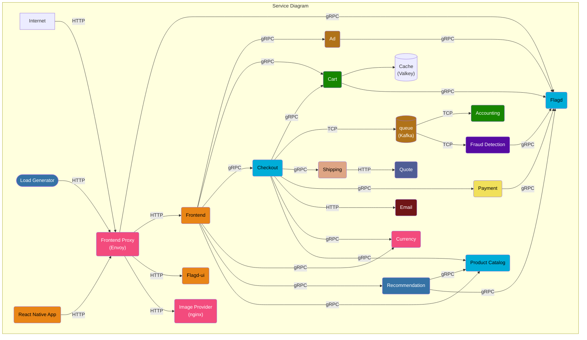
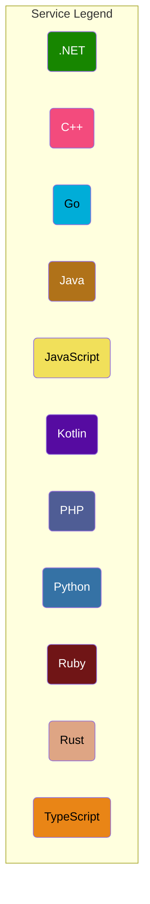

# Chaos-Mesh-OTel

## 2025, Thursday (8:30 AM)

**Authors:**  
- Antoni Wójcik  
- Grzegorz Piśkorski  
- Kacper Jurek  
- Wojciech Suski  

---

## Contents

1. [Introduction](#1-introduction)  
2. [Theoretical background / technology stack](#2-theoretical-background--technology-stack)  
   1. [Fault injections](#fault-injections)  
   2. [Key Technologies Used](#key-technologies-used)  
3. [Case study concept description](#3-case-study-concept-description)  
   1. [Test Scenarios](#test-scenarios)  
   2. [Observability and Monitoring](#observability-and-monitoring)  
4. [Solution architecture](#4-solution-architecture)  
   1. [General Architecture](#41-general-architecture)  
   2. [Architecture Overview](#42-architecture-overview)  
   3. [Component Roles and Interactions](#43-component-roles-and-interactions)  
      - [Minikube (Kubernetes Environment)](#minikube-kubernetes-environment)  
      - [Chaos Mesh](#chaos-mesh)  
      - [Prometheus](#prometheus)  
      - [Grafana](#grafana)  
      - [Load Generator](#load-generator)  
      - [Online Boutique Microservices](#online-boutique-microservices)  
5. [Environment configuration description](#5-environment-configuration-description)  
6. [Installation method](#6-installation-method)  
7. [How to reproduce - step by step](#7-how-to-reproduce---step-by-step)  
   1. [Infrastructure as Code approach](#71-infrastructure-as-code-approach)  
8. [Demo deployment steps](#8-demo-deployment-steps)  
   1. [Configuration set-up](#81-configuration-set-up)  
   2. [Data preparation](#82-data-preparation)  
   3. [Execution procedure](#83-execution-procedure)  
   4. [Results presentation](#84-results-presentation)  
9. [Using AI in the project](#9-using-ai-in-the-project)  
10. [Summary – conclusions](#10-summary--conclusions)  
11. [References](#11-references)  


## 1. Introduction
Chaos Mesh is an open source cloud-native Chaos Engineering platform. It offers various types of fault simulation and has an enormous capability to orchestrate fault scenarios. Using Chaos Mesh, we can conveniently simulate various abnormalities that might occur in reality during the development, testing, and production environments and find potential problems in the system. To lower the threshold for a Chaos Engineering project, Chaos Mesh provides us with a visualization operation. We can easily design our Chaos scenarios on the Web UI and monitor the status of Chaos experiments.

Core strengths of Chaos Mesh:
* An easy-to-use system: Chaos Mesh makes full use of automation with graphical operations and Kubernetes-based usage.
* Cloud Native: Chaos Mesh supports Kubernetes environment with its powerful automation ability.
* Various fault simulation scenarios: Chaos Mesh covers most of the scenarios of basic fault simulation in the distributed testing system.
* Flexible experiment orchestration capabilities: We can design our own Chaos experiment scenarios on the platform, including multiple mixing experiments and application status checks.
* High security: Chaos Mesh is designed with multiple layers of security control and provides high security.
* Easily scalable: It's easy to add new fault test types and functions to Chaos Mesh.


## 2. Theoretical background / technology stack
### Fault injections
Fault injection is the key of Chaos experiments. Chaos Mesh covers a full range of faults that might occur in a distributed system, and provides three comprehensive and fine-grained fault types: basic resource faults, platform faults, and application-layer faults.
* Basic resource faults:
  - PodChaos: simulates Pod failures, such as Pod node restart, Pod's persistent unavailability, and certain container failures in a specific Pod.
  - NetworkChaos: simulates network failures, such as network latency, packet loss, packet disorder, and network partitions.
  - DNSChaos: simulates DNS failures, such as the parsing failure of DNS domain name and the wrong IP address returned.
  - HTTPCHaos: simulates HTTP communication failures, such as HTTP communication latency.
  - StressChaos: simulates CPU race or memory race.
  - IOChaos: simulates the I/O failure of an application file, such as I/O delays, read and write failures.
  - TimeChaos: simulates the time jump exception.
  - KernelChaos: simulates kernel failures, such as an exception of the application memory allocation.
* Platform faults:
  - AWSChaos: simulates AWS platform failures, such as the AWS node restart.
  - GCPChaos: simulates GCP platform failures, such as the GCP node restart.
* Application faults:
  - JVMChaos: simulates JVM application failures, such as the function call delay.

### Key Technologies Used

- **Kubernetes**  
  A powerful container orchestration system used to deploy, manage, and scale containerized applications. Chaos Mesh runs natively within Kubernetes clusters.

- **Chaos Mesh**  
  The core Chaos Engineering platform used to inject faults into Kubernetes-managed applications for testing system resilience.

- **Chaos Dashboard**  
  A web-based UI for creating, managing, and visualizing chaos experiments and workflows.

- **Prometheus** (optional)  
  An open-source monitoring and alerting toolkit used to collect metrics from the application during chaos experiments.

- **Grafana** (optional)  
  A visualization tool often paired with Prometheus to monitor the effects of chaos injections in real time.


## 3. Case study concept description

The goal of this case study is to demonstrate the practical usage of **Chaos Mesh** in a Kubernetes environment to simulate various fault scenarios, evaluate system resilience, and observe the behavior of the **OpenTelemetry Demo – _Astronomy Shop_** microservices application under stress. We aim to showcase how chaos‑engineering principles can be applied to a real-world application while collecting and visualizing telemetry data using the **OpenTelemetry Collector**, **Prometheus**, and **Grafana**.

This proof of concept focuses on running controlled chaos experiments across four distinct fault categories provided by Chaos Mesh:

### Test Scenarios

1. **Pod Fault Injection**
   - **Objective:** Simulate the crash or eviction of critical pods to test how the system recovers and how quickly Kubernetes reschedules the affected pods.
   - **Example:** Terminate the `checkout` or `frontend` pod and monitor user experience, recovery time, and service availability.
   - **Expected Outcome:** Kubernetes should reschedule the pod. Dashboards should show brief unavailability or latency spikes.

2. **Network Fault Injection**
   - **Objective:** Introduce artificial network issues such as latency, packet loss, or partitioning to observe the impact on inter-service communication.
   - **Example:** Add 1000 ms latency between `frontend` and `productcatalog` services.
   - **Expected Outcome:** Increase in response times, potential timeouts, visible in Grafana panels showing request durations and error rates.

3. **Stress Testing (CPU & Memory)**
   - **Objective:** Apply high CPU or memory load to simulate resource exhaustion and observe system degradation or auto-scaling responses.
   - **Example:** Apply CPU stress on the `recommendation` service to consume all available cores for 60 seconds.
   - **Expected Outcome:** Service latency increases, possible throttling, potential pod restarts. Metrics should indicate high CPU usage and degraded performance.

4. **HTTP Fault Injection**
   - **Objective:** Introduce artificial HTTP response delays or errors to verify error-handling logic and system robustness.
   - **Example:** Inject 500 ms delay and 10% HTTP 500 responses to the `ad` service.
   - **Expected Outcome:** Increased error rate and degraded user experience; dashboards reflect anomalies in HTTP metrics (e.g., 5xx rate spike).

### Observability and Monitoring

Each test will be executed with telemetry data collection enabled. The **OpenTelemetry Collector** will export traces, metrics, and logs from the Astronomy Shop services and Chaos Mesh. **Prometheus** will scrape the Collector’s Prometheus exporter endpoints, and **Grafana** dashboards will visualize:

- Request/response latency
- CPU/memory usage
- Pod availability status
- Error rates
- Service-level indicators (SLIs)

The main objective is to analyze how each fault scenario affects the performance and stability of the system and how quickly the system returns to normal operation. This approach highlights the importance of chaos engineering in identifying potential weaknesses before they occur in production.


## 4. Solution architecture

### 4.1 General Architecture
[](/docs/img/otel.png)

The solution is designed to run in a **local Kubernetes cluster**, provisioned using **Minikube**, and integrates various components including microservices, observability tooling, and fault injection infrastructure. This architecture emulates a production-grade environment on a local machine for the purpose of experimentation, validation, and educational demonstration.

### 4.2 Architecture Overview

The core components of the architecture include:

* **Minikube** — Local Kubernetes environment simulating a production-like cluster.
* **OpenTelemetry Demo (Astronomy Shop)** — A polyglot e-commerce microservices application (~20 services) built to showcase end-to-end observability with traces, metrics, and logs.
* **Chaos Mesh** — A chaos-engineering toolset used to inject controlled faults into the system.
* **OpenTelemetry Collector** — Unified pipeline exporting telemetry from all services (and Chaos Mesh) to back-ends.
* **Prometheus** — Scrapes the Collector’s Prometheus exporter for metrics and stores time-series data.
* **Grafana** — Visualises Prometheus and trace data for rapid insight.
* **Load Generator** — The `loadgenerator` service, which produces realistic traffic against the public `frontend` entry point.

### 4.3 Component Roles and Interactions

#### **Minikube (Kubernetes Environment)**

* Provides a local container-orchestrated environment.
* Hosts all application workloads including Astronomy Shop microservices, Chaos Mesh, and observability tools.
* Enables testing of service orchestration, fault tolerance, and pod lifecycle management.

#### **Chaos Mesh**

* Deployed into the Minikube cluster using Helm.
* Includes a dashboard for visual scenario creation and a set of CRDs and controllers for fault injection.
* Targets specific pods or services within Online Boutique for chaos experiments (e.g., network delays, pod terminations, CPU stress).

#### **Prometheus**

* Automatically scrapes metrics from Online Boutique services and Chaos Mesh components.
* Stores time-series metrics for resource usage, HTTP/gRPC performance, error rates, etc.
* Also collects Kubernetes-specific metrics (e.g., pod restarts, CPU usage).

#### **Grafana**

* Connects to Prometheus as a data source.
* Visualizes key metrics across services and the cluster.
* Dashboards include:

  * Service-level latency and error rates
  * CPU and memory consumption
  * Pod availability and restart frequency
  * Specific Chaos Mesh experiment timelines and impact

#### **Load Generator**
* Continuously issues HTTP requests to the public `frontend-proxy`, emulating realistic shopping journeys so that faults have observable impact.
* Ensures that there is live traffic during chaos scenarios to observe system degradation and recovery.

#### **OpenTelemetry Demo Microservices**
* Comprises ~20 microservices representing an astronomy-themed e-commerce store.
* Mix of HTTP, gRPC, and Kafka event flows; polyglot tech stack demonstrates distributed-tracing across languages.
* `frontend-proxy` (Envoy) is the single ingress point for users and for the load generator.





| Service / Component                                 | Language / Tech | Purpose (Astronomy Shop)                                                                                          |
| --------------------------------------------------- | --------------- | ------------------------------------------------------------------------------------------------------------------ |
| **frontend**                                        | TypeScript/React| Browser UI; renders product pages and checks out via gRPC calls routed through Envoy.                              |
| **frontend-proxy (Envoy)**                          | C++             | Edge proxy (HTTP → gRPC) injecting trace headers, RBAC, retries, and metrics.                                      |
| **product-catalog**                                 | Go              | Supplies product data (astronomy gear) with basic search & lookup endpoints.                                       |
| **cart**                                            | C# (.NET)       | Persists users’ shopping carts in **Valkey** (Redis-compatible) and exposes gRPC API.                              |
| **checkout**                                        | Go              | Orchestrates cart retrieval, pricing, payment, shipping, email, and publishes order events to Kafka.               |
| **payment**                                         | Node.js         | Mock card-payment gateway; returns transaction IDs.                                                                |
| **currency**                                        | C++             | Converts prices to user-preferred currency based on ECB rates.                                                     |
| **shipping**                                        | Rust            | Calculates shipping costs and confirms dispatch; queries **quote** for insurance.                                  |
| **recommendation**                                  | Python          | Suggests additional astronomy products based on current cart.                                                      |
| **ad**                                              | Java            | Delivers contextual text ads for product pages.                                                                    |
| **email**                                           | Ruby            | Sends order-confirmation emails (mock).                                                                            |
| **flagd**                                           | Go              | Feature-flag daemon; allows dynamic toggling of experiments and service behaviour.                                 |
| **flagd-ui**                                        | TypeScript/Vue  | Simple UI for viewing & flipping feature flags via flagd’s REST/gRPC API.                                          |
| **fraud-detection**                                 | Kotlin          | Consumes checkout events from Kafka to detect suspicious transactions.                                             |
| **accounting**                                      | C# (.NET)       | Subscribes to order events, records them in an accounting ledger.                                                  |
| **quote**                                           | PHP             | Returns insurance quotes used by Shipping for high-value items.                                                    |
| **image-provider (nginx)**                          | C++             | Serves static product and ad images.                                                                               |
| **queue (Kafka)**                                   | Java            | Event backbone connecting Checkout → Accounting / Fraud-Detection.                                                 |
| **cache (Valkey/Redis)**                            | C              | In-memory store backing Cart service.                                                                              |
| **loadgenerator**                                   | Python / Locust | Generates continuous, trace-instrumented traffic to exercise the entire application.                              |
   

## 5. Environment configuration description

### Purpose of Using Minikube

Minikube is a local Kubernetes distribution designed for development and testing purposes. It allows users to create lightweight Kubernetes clusters directly on a local machine. In this project, Minikube was chosen to host a simulated microservices-based application and provide an isolated, reproducible testing ground for failure injection using Chaos Mesh.

Its main role is to:

- Simplify deployment and orchestration of multiple containerized services.
- Provide a local platform to simulate realistic production-like conditions.
- Enable testing of fault tolerance strategies without external infrastructure dependencies.

### Role of Microservices-Based Application

To study system robustness under adverse conditions, a realistic application architecture is required. The **OpenTelemetry Astronomy Shop Demo** — a cloud-native microservices application — was used as the system under test. It simulates an online store composed of multiple interdependent services, including frontend, product catalog, cart, checkout, recommendation, and payment services.

The purpose of this application in the environment is to:

- Represent a complex, stateful, and realistic production workload.
- Demonstrate how cascading failures and bottlenecks occur between services.
- Serve as a testbed for policy learning under system stress (e.g., simulating partial lockdowns through resource constraints or failures).

### Use of Chaos Mesh

**Chaos Mesh** is a powerful chaos engineering platform designed to introduce failures into Kubernetes-based systems. It enables the simulation of various fault types (e.g., pod failure, network delay, disk I/O error) to evaluate the resilience and recovery behavior of applications.

In this setup, Chaos Mesh is used to:

- Inject controlled failures into specific microservices.
- Test the environment's fault tolerance and self-healing properties.
- Provide a basis for reinforcement learning agents to observe state transitions resulting from system perturbations.

Pod failure scenarios were used to emulate real-world crashes, service restarts, or node outages. These experiments helped evaluate how well the system recovers and whether DQN-based policies can anticipate and mitigate such disruptions.


### Monitoring Stack: Prometheus and Grafana

To assess the impact of chaos experiments and evaluate learned policies, detailed metrics are required. **Prometheus** was used as the metrics collection system, and **Grafana** provided real-time dashboards for visualization.

These tools were used to:

- Collect quantitative data about system health, resource usage, and failure recovery.
- Visualize key metrics that serve as reward signals for the DQN agent.
- Enable manual inspection of system behavior during experiments.

Together, they form the observability layer of the environment, providing insight into how each failure impacts the system and how policies affect stability.

### Summary

The environment configuration combines Minikube (for local orchestration), Chaos Mesh (for failure injection), and Prometheus/Grafana (for monitoring). The Google microservices demo provides a realistic workload. This setup enables safe, repeatable experiments to test the impact of failures and explore how Deep Q-Learning can optimize policy responses in dynamic and uncertain environments.


This section describes the setup and configuration steps taken to prepare the experimental environment for Chaos Mesh experiments.

## 6. Installation method


### Minikube Setup

To simulate a local Kubernetes environment, **Minikube** was installed and configured using the following steps:

```bash
sudo install minikube-linux-amd64 /usr/local/bin/minikube
minikube start
eval $(minikube docker-env)
```

These steps enabled the use of Minikube's internal Docker daemon, allowing built images to be used directly by Kubernetes without pushing them to an external registry

### Chaos Mesh Installation

To simulate failures, Chaos Mesh was installed using Helm:

1. Install Helm:
  ```
  curl -fsSL -o get_helm.sh https://raw.githubusercontent.com/helm/helm/main/scripts/get-helm-3
  chmod 700 get_helm.sh
  ./get_helm.sh
  ```
2. Add the Chaos Mesh Helm chart:
```
helm repo add chaos-mesh https://charts.chaos-mesh.org
```
3. Create a dedicated namespace and install Chaos Mesh:
```
kubectl create ns chaos-mesh
helm install chaos-mesh chaos-mesh/chaos-mesh -n=chaos-mesh --set dashboard.securityMode=false --version 2.7.2

```
`securityMode=false` was used to disable the safe mode


### Istio and Monitoring Setup

To enable observability and traffic control, Istio was installed along with Grafana and Prometheus:

Istio install:

```
curl -L https://istio.io/downloadIstio | sh -
cd istio-1.26.0
export PATH=$PWD/bin:$PATH
stioctl manifest apply --set profile=demo
```

Enable automatic sidecar injection in the default namespace:

```
kubectl label namespace default istio-injection=enabled

```

To enable observability and traffic control, Istio was installed along with Grafana and Prometheus:
```

kubectl apply -f https://raw.githubusercontent.com/istio/istio/release-1.21/samples/addons/grafana.yaml
kubectl apply -f https://raw.githubusercontent.com/istio/istio/release-1.21/samples/addons/prometheus.yaml
```

You can access the Grafana dashboard for monitoring with:
```
istioctl dashboard grafana

```

### Application Under Chaos Test

To create a realistic microservices environment, the Google Cloud Microservices Demo was used:

```
git clone https://github.com/GoogleCloudPlatform/microservices-demo.git
cd microservices-demo/release/
kubectl apply -f kubernetes-manifests.yaml
```

This application includes multiple services (e.g., frontend, product catalog, cart service), which makes it a good target for chaos experiments.


## 7. How to reproduce - step by step

### 7.1 Infrastructure as Code approach

## 8. Demo deployment steps

### 8.1 Configuration set-up

### 8.2 Data preparation

### 8.3 Execution procedure

### 8.4 Results presentation

## 9. Using AI in the project

## 10. Summary – conclusions
The Chaos-Mesh-OTel project successfully demonstrated the application of chaos engineering techniques in a Kubernetes environment using Chaos Mesh, OpenTelemetry, Prometheus, and Grafana. Our key findings and conclusions are as follows:

1. Chaos Engineering Validated as a Powerful Testing Method
Controlled fault injection (e.g., pod crashes, network issues, CPU stress) enabled us to proactively uncover weaknesses in microservice interdependencies, autoscaling behaviors, and resiliency mechanisms that traditional testing often overlooks.

2. Observability is Crucial for Insightful Analysis
Leveraging OpenTelemetry allowed us to collect unified traces, metrics, and logs from across the distributed system. When combined with Prometheus and Grafana, this enabled real-time visibility into the impact of faults and system recovery processes.

3. The Astronomy Shop Provided a Realistic Testbed
The polyglot nature and microservice architecture of the Astronomy Shop application, alongside its integration with OpenTelemetry and load generation, made it an ideal environment to test both technical resilience and user-facing performance under chaos scenarios.

4. Fault Injection Effects Were Measurable and Traceable
Each test scenario produced observable changes in latency, error rates, or system behavior. For example, CPU stress resulted in throttled requests and delayed responses, while pod crashes led to brief unavailability until Kubernetes rescheduled the services.

5. Recovery Mechanisms Worked but Not Always Optimally
Kubernetes handled pod restarts effectively, but in some cases recovery time was longer than expected. This highlights opportunities to tune readiness/liveness probes, autoscaling thresholds, and resource requests/limits.

6. Chaos Mesh Workflow Simplifies Experiment Design
The visual interface and CRD-based architecture of Chaos Mesh made it easy to define and manage experiments, from simple pod disruptions to more complex network partition simulations.

7. Limitations of Local Testing Noted
While Minikube allowed rapid local iteration, some faults (e.g., node-level failures or cloud-specific disruptions) could not be fully reproduced. A production-like staging environment would be better for testing platform-level resilience.

8. AI Augmentation Potential Identified
Although not deeply integrated, initial experiments using AI (e.g., for anomaly detection or log classification) showed promise in accelerating root cause analysis during chaos events. This area warrants further exploration.

9. Chaos Testing Should Be Continuous
One-time experiments are insightful, but the true value of chaos engineering lies in continuous validation. Integrating these experiments into CI/CD pipelines would ensure long-term system robustness.

10. Educational and Practical Value Demonstrated
Beyond its technical outcomes, the project proved effective in increasing our understanding of Kubernetes-based systems, observability tooling, and real-world challenges in distributed systems resilience.

In summary, the Chaos-Mesh-OTel project validates that injecting controlled failures into cloud-native applications, coupled with robust observability, significantly improves the ability to design, operate, and scale resilient systems.

## 11. References
